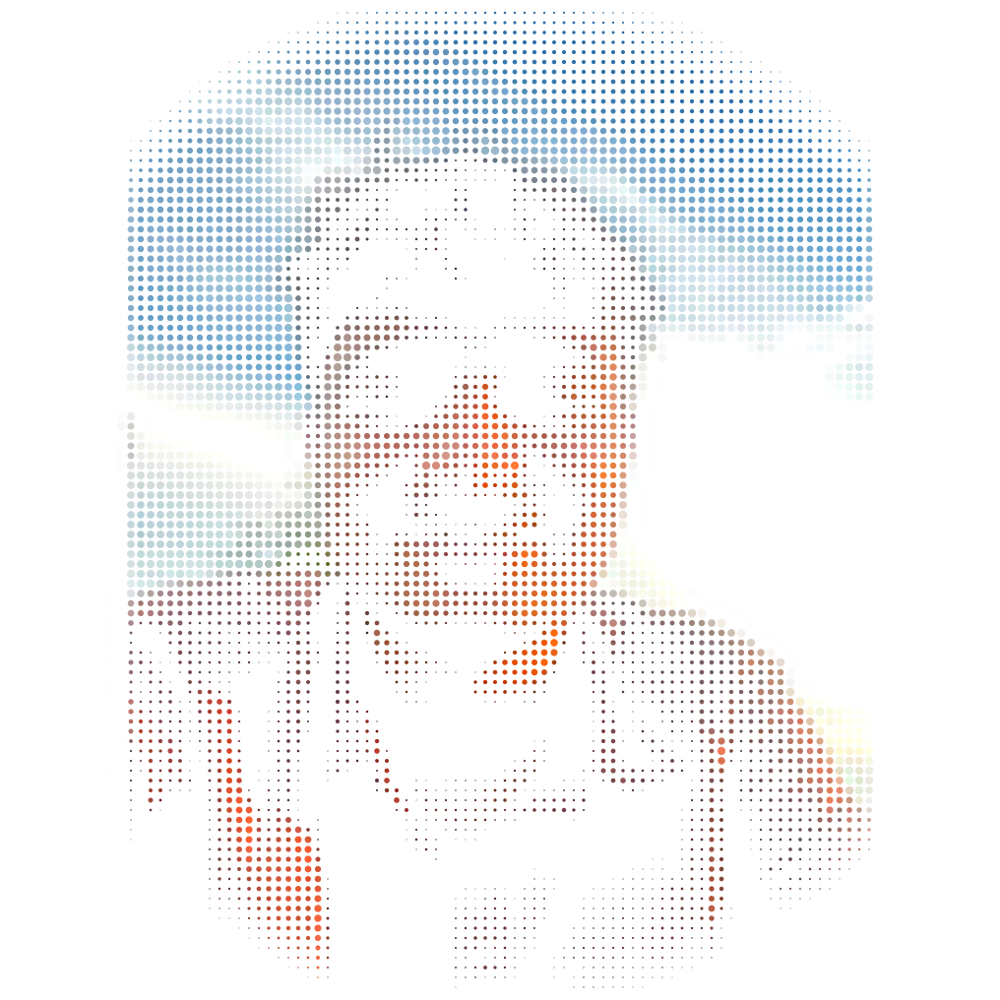
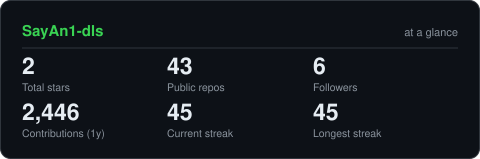
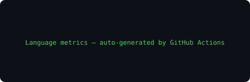
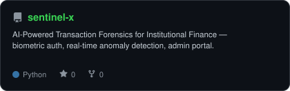
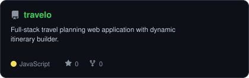
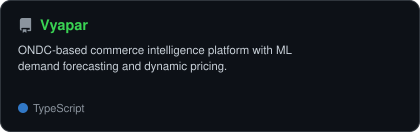

<div align="center">

<!-- PORTRAIT - generated by scripts/dotify.py from assets/avatar.png.
     Colour mode, one file serves both themes. Regenerate with:
       python scripts/dotify.py assets/avatar.png -o assets/portrait \
         --cols 100 --equalize --detail 0.5 --color --circle --animate -->


<br>

<!-- NAME / TAGLINE - animated typing -->
<a href="https://github.com/SayAn1-dls">
  
</a>

<br>

<!-- SOCIALS -->
<a href="https://linkedin.com/in/sayan-bhattacharya-b78529318"></a>
<a href="mailto:sayanbhatt2005@gmail.com"></a>
<a href="https://sentinel-x-sayan1-dls-projects.vercel.app"></a>


</div>

---

## `~/` whoami

```console
$ cat about.txt
```

Hi, I'm **Sayan Bhattacharya**. I build things that sit somewhere between machine learning and the web — forensic AI systems, commerce intelligence layers, and travel platforms that actually work.

- Currently building **[Sentinel-X](https://github.com/SayAn1-dls/sentinel-x)** and **[Vyapar](https://github.com/SayAn1-dls/Vyapar)**
- Portfolio: **[sentinel-x-sayan1-dls-projects.vercel.app](https://sentinel-x-sayan1-dls-projects.vercel.app)**
- Learning **Deep Learning + Machine Learning**
- Fun fact: **I started coding to build things I wished existed — and haven't stopped since.**

<br>

<div align="center">

## `~/` toolbox


</div>

---

<div align="center">

## `~/` skill radar

<table>
<tr>
<td width="50%" align="center" valign="middle">

<!-- Self-rated radar - edit assets/skills.json, the workflow redraws it -->
<picture>
  <source media="(prefers-color-scheme: dark)"  srcset="assets/radar-dark.svg">
  <source media="(prefers-color-scheme: light)" srcset="assets/radar-light.svg">
  
</picture>

</td>
<td width="50%" align="center" valign="middle">

<!-- Live radar built from real language byte counts across your repos -->
<picture>
  <source media="(prefers-color-scheme: dark)"  srcset="assets/radar-langs-dark.svg">
  <source media="(prefers-color-scheme: light)" srcset="assets/radar-langs-light.svg">
  
</picture>

</td>
</tr>
</table>

</div>

---

<div align="center">

## `~/` contribution calendar

<!-- 3D isometric calendar, regenerated every 6h by .github/workflows/metrics.yml -->


<br><br>

<!-- Snake eats the contribution graph - .github/workflows/snake.yml -->
<picture>
  <source media="(prefers-color-scheme: dark)"  srcset="https://raw.githubusercontent.com/SayAn1-dls/SayAn1-dls/output/snake-dark.svg">
  <source media="(prefers-color-scheme: light)" srcset="https://raw.githubusercontent.com/SayAn1-dls/SayAn1-dls/output/snake.svg">
  
</picture>

</div>

---

<div align="center">

## `~/` the numbers

<!-- Generated by scripts/cards.py. Self-hosted: no external service downtime. -->
<picture>
  <source media="(prefers-color-scheme: dark)"  srcset="assets/card-stats-dark.svg">
  <source media="(prefers-color-scheme: light)" srcset="assets/card-stats-light.svg">
  
</picture>

<br>



<br><br>


</div>

---

<div align="center">

## `~/` selected work

<!-- Cards generated by scripts/cards.py from assets/projects.json -->
<table>
<tr>
<td width="50%">
  <a href="https://github.com/SayAn1-dls/sentinel-x">
    <picture>
      <source media="(prefers-color-scheme: dark)"  srcset="assets/card-sentinel-x-dark.svg">
      <source media="(prefers-color-scheme: light)" srcset="assets/card-sentinel-x-light.svg">
      
    </picture>
  </a>
</td>
<td width="50%">
  <a href="https://github.com/SayAn1-dls/Travelo">
    <picture>
      <source media="(prefers-color-scheme: dark)"  srcset="assets/card-Travelo-dark.svg">
      <source media="(prefers-color-scheme: light)" srcset="assets/card-Travelo-light.svg">
      
    </picture>
  </a>
</td>
</tr>
<tr>
<td width="50%">
  <a href="https://github.com/SayAn1-dls/Vyapar">
    <picture>
      <source media="(prefers-color-scheme: dark)"  srcset="assets/card-Vyapar-dark.svg">
      <source media="(prefers-color-scheme: light)" srcset="assets/card-Vyapar-light.svg">
      
    </picture>
  </a>
</td>
<td width="50%" align="center" valign="middle">
  <br>
  <b>📍 New Delhi, India</b><br><br>
  
</td>
</tr>
</table>

<sub>

| project | live | stack |
|---|---|---|
| **[sentinel-x](https://github.com/SayAn1-dls/sentinel-x)** | [sentinel-x-sayan1-dls-projects.vercel.app](https://sentinel-x-sayan1-dls-projects.vercel.app) | `Python` `React` `MongoDB` `ML` |
| **[Travelo](https://github.com/SayAn1-dls/Travelo)** | — | `JavaScript` `Node.js` |
| **[Vyapar](https://github.com/SayAn1-dls/Vyapar)** | — | `Next.js` `FastAPI` `ML` |

</sub>

</div>

---

<div align="center">

<sub>`01110011 01100001 01111001 01100001 01101110 00100000 01100010 01101000 01100001 01110100 01110100 01100001 01100011 01101000 01100001 01110010 01111001 01100001`</sub>

</div>
